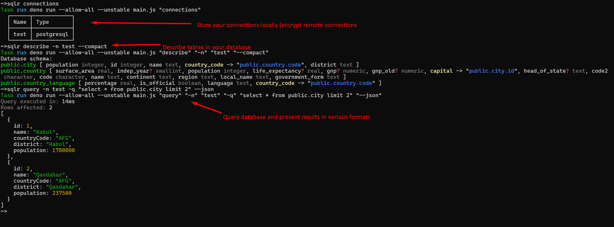

# About

Sqlr is a simple CLI utility that allows you to execute simple queries against 
your SQL database (currently only Postgres database is supported).

- :zap: Don't wait for your GUI tools to load, when you need to run simple SQL query
- :lock: Connection encryption for enhanced security (recommended for remote environments)
- :scroll: List your database structure to quickly identify which columns are in specific table
- :avocado: Present results in compact form, json or tables
- :file_folder: Use queries from `.sql` files and/or save results to `.json` files
- :abacus: CI/CD friendly - commands can be executed directly, without `interactive` prompts



Run `sqlr` for details on available commands. For each command use `--help` flag for details on additional options and arguments.

## Prerequisites

Deno runtime environment `https://deno.land`

## Installation

`deno install -f -r --allow-net --allow-read --allow-write https://deno.land/x/sqlr/main.js`

`--allow-write` permission is needed only if you are planning to use `-o`
parameter (write results to json file, check `sqlr query --help` for details)

## Hints

If you want to disable colors (at least for main log messages), you can use:

```
NO_COLOR=1 sqlr ...
```

## Contribution

If you want to implement/request new features you are more than welcome to
contribute.
