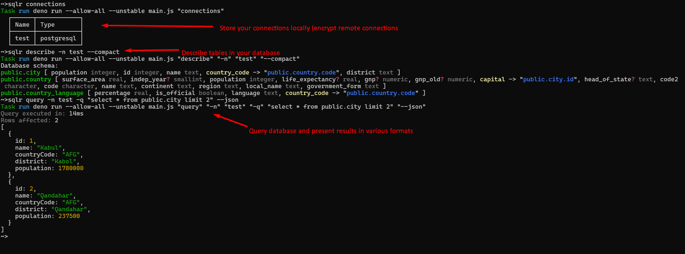

# About

Sqlr is a simple CLI utility that allows you to execute simple queries against
your SQL database (currently only Postgres database is supported).

- :zap: Don't wait for your GUI tools to load, when you need to run simple SQL
  query
- :lock: Connection encryption for enhanced security (recommended for remote
  environments)
- :scroll: List your database structure to quickly identify which columns are in
  specific table
- :avocado: Present results in compact form, json or tables
- :file_folder: Use queries from `.sql` files and/or save results to `.json`
  files
- :abacus: CI/CD friendly - commands can be executed directly, without
  `interactive` prompts
- :robot: AI agent friendly - agents can query databases by connection name
  without exposing connection strings in their context



Run `sqlr` for details on available commands. For each command use `--help` flag
for details on additional options and arguments.

## Prerequisites

Deno runtime environment `https://deno.land`

## Installation

`deno install -g -f -r --allow-env --allow-net --allow-read --allow-write jsr:@sobanieca/sqlr`

`--allow-write` permission is needed only if you are planning to use `-o`
parameter (write results to json file, check `sqlr query --help` for details)

If your queries are failing due to certificate validation errors (and you trust
target server) you can install using following command:

`deno install -g -f -r --unsafely-ignore-certificate-errors --allow-env --allow-net --allow-read --allow-write jsr:@sobanieca/sqlr`

This means however, that you are no longer protected from MITM attacks for other
servers. You can consider introducing `sqlr-unsafe` sitting next to your main
`sqlr` instance to work with trusted servers with problematic certificates:

`deno install -g -f -r -n sqlr-unsafe --unsafely-ignore-certificate-errors --allow-net --allow-read --allow-write jsr:@sobanieca/sqlr`

## Using with AI agents

Sqlr stores database connections locally by name. This makes it a great fit for
AI agents that need to query databases — the agent only needs to know the
connection name (e.g. `sqlr query -n mydb -q "SELECT ..."`), and never has
access to the actual connection string. Connection strings stay on your machine
and are never exposed in the agent's context.

## SQL file collections

You can maintain a collection of `.sql` files and execute them with sqlr whenever
needed. This is useful for queries you run repeatedly — health checks, reports,
data fixes, etc.

```
queries/
  health-check.sql
  daily-report.sql
  cleanup-stale-sessions.sql
```

Run any file from the collection using the `-i` flag:

```
sqlr query -n mydb -i queries/health-check.sql
sqlr query -n mydb -i queries/daily-report.sql
```

This way your queries are version-controlled, reusable, and don't need to be
typed out or remembered each time.

## Hints

If you want to disable colors (at least for main log messages), you can use:

```
NO_COLOR=1 sqlr ...
```

## Contribution

If you want to implement/request new features you are more than welcome to
contribute.
